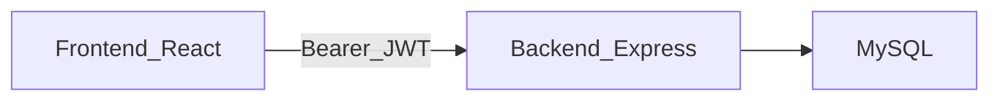

# Medication Tracker (Term Project)

## Overview
Medication Tracker is a full‑stack school project for tracking prescriptions, refills, and dose adherence. It supports multiple user roles with **RBAC** (role-based access control) and follows **least privilege**: each role gets only the actions it needs.

## Tech stack / architecture
- **Frontend**: React + Vite + TypeScript (pages under `frontend/src/pages/`)
- **Backend**: Node + Express + TypeScript (routes under `backend/src/routes/`)
- **Database**: MySQL (schema in `term-project-schema.sql`)
- **Auth**: JWT bearer tokens containing `roles[]`, `userType`, and optional `patientId` / `doctorId`

## Data model (core tables)
- **Doctors**: provider directory
- **Patients**: patient directory + `PrimaryDoctorID` (nullable)
- **Pharmacies**: pharmacy directory
- **Medications**: medication reference catalog
- **Prescriptions**: central link (Patient ↔ Doctor ↔ Medication ↔ Pharmacy) + dosage/frequency/start/end
- **Refills**: dispensing events for a prescription
- **Dose_Logs**: adherence events (Taken/Missed/Late) for a prescription

## Authentication + RBAC
### JWT claims
Backend issues a JWT at `POST /auth/login` that includes:
- `roles: RoleName[]`
- `userType: 'patient' | 'doctor' | 'admin' | 'staff'`
- `patientId` / `doctorId` (nullable)

### Enforcement model (least privilege)
RBAC is enforced **server-side**:
- `authenticateJWT` validates the bearer token and populates `req.user`
- `requireRole(...)` checks `req.user.roles`
- Resource “ownership” checks are applied where needed (e.g., doctors can only act on their own prescriptions/refills)

Frontend route gating (`RequireRole`) and navigation filtering improve UX, but **do not replace backend authorization**.

### Roles and capabilities
#### `patient`
- **Can**:
  - View own dashboard / schedule
  - View own prescriptions and adherence summaries (scoped to self)
  - Log doses (if enabled in UI/routes)
- **Cannot**:
  - View or modify other users’ data
  - Create or edit prescriptions/refills

#### `doctor`
- **Can**:
  - Use Doctor Dashboard (adherence + alerts) scoped to their patient roster
  - CRUD **their** prescriptions (server enforces `DoctorID` ownership)
  - Create refills for prescriptions where `DoctorID` matches (server enforces ownership)
  - View patients limited to those with at least one of their prescriptions
- **Cannot**:
  - Manage users/roles
  - Delete or edit doctors directory
  - Reassign patients’ `PrimaryDoctorID`

#### `pharmacy_tech` (staff)
- **Intent**: fulfillment workflows (“fill subscriptions”) with minimal clinical permissions.
- **Can**:
  - View prescriptions (for dispensing workflows)
  - View refills
  - Create refills
  - **Limited** prescription updates: only `PharmacyID` and `EndDate` (backend blocks other fields)
- **Cannot**:
  - Create/edit clinical prescription fields (DoctorID/PatientID/MedID/Dosage/Frequency/StartDate)
  - Manage doctors/patients directories

> Note: there is no per‑pharmacy identity in the current schema/JWT, so pharmacy tech access is not scoped to a specific pharmacy location.

#### `secretary` (staff)
- **Intent**: administrative coordination, not clinical control.
- **Can**:
  - View doctors directory
  - View patient list
  - Assign/clear `Patients.PrimaryDoctorID` via `PUT /patients/:id/primary-doctor`
- **Cannot**:
  - CRUD prescriptions/medications/refills
  - Modify patient demographics (admin-only)

#### `admin`
- **Can**: full CRUD across directories and workflows (doctors/patients/pharmacies/medications/prescriptions) + admin console
- **Cannot**: (by design) nothing in this demo, but should still follow least-privilege in real deployments

## Key backend endpoints (high-level)
- **Auth**: `POST /auth/login`
- **Doctor dashboard**: `GET /doctors/me/dashboard`
- **Patients**:
  - `GET /patients` (admin/doctor/secretary; doctor is roster-scoped)
  - `PUT /patients/:id/primary-doctor` (admin/secretary)
- **Doctors**: `GET /doctors` (admin/secretary), CRUD is admin-only
- **Prescriptions**:
  - `GET /prescriptions` (scoped by role)
  - `POST/PUT/DELETE` (doctor/admin; pharmacy tech has limited PUT fields)
- **Refills**:
  - `GET /refills` (admin/doctor/pharmacy_tech)
  - `POST /refills` (admin/doctor/pharmacy_tech; doctor is ownership-scoped)

## Frontend “views” by role
- **Patient**: `/dashboard`
- **Doctor**: `/doctor-dashboard`
- **Pharmacy tech**: `/pharmacy-tech`
- **Secretary**: `/secretary`
- **Admin**: `/admin` (manager console; links to management pages)

## Demo accounts
All demo accounts use password `password`.
- Admin: `admin`
- Pharmacy tech: `pharmacytech`
- Secretary: `secretary`
- Doctors: `doctor<DoctorID>` (e.g. `doctor1`)
- Patients: their email (from `data/patients.csv`)

## Local setup (typical)
1. Create `.env` for MySQL connection (see `.env.example` if present).
2. Reset + load demo data:
   - Run `python load_data.py --reset`
3. Start backend (Express) and frontend (Vite) using the project’s existing scripts.

## Security notes (demo constraints)
- Passwords are stored in plain text by design for a school demo (see schema comments). Do not copy this pattern to production.
- Always treat **backend** route guards + ownership checks as the source of truth for authorization decisions.

