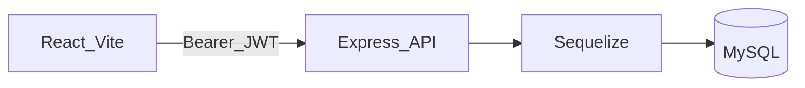

# Medication Tracker — Final Term Project (CSC 3320)

**Student:** Oliver Grudzinski  
**Course alignment:** Full application with relational database integration, React front end, and API layer (see assignment rubric: scope, database design, SQL quality, functionality, UX, security, testing, documentation, presentation).

This document summarizes what was **proposed**, what was **built**, and how it maps to the **required report sections** (motivation, tech stack, database design, security, testing, challenges, reflection). Operational setup, seed data, and demo accounts are in the repo **[README.md](../README.md)** and **[DEMO_LOGINS.md](../DEMO_LOGINS.md)**.

---

## 1. Problem, users, and motivation

**Problem:** Patients on multiple prescriptions struggle to remember doses; missed or duplicated doses hurt outcomes. Clinicians and pharmacy staff also need a coherent view of prescriptions, refills, and adherence.

**Users and tasks:**

| User | Main tasks |
|------|------------|
| **Patient** | View today’s medication schedule, log doses (Taken / Missed / Late), see adherence summary for a date range |
| **Doctor** | Manage **own** prescriptions and refills for roster patients; open **Doctor Dashboard** with roster adherence, trends, and alerts (low adherence, missed today, stale logging) |
| **Admin** | Full CRUD on directories (patients, doctors, pharmacies, medications) and clinical workflows |
| **Pharmacy technician** | View prescriptions; create refills; limited prescription updates (**PharmacyID**, **EndDate** only) |
| **Secretary** | View doctors and patients; assign or clear **PrimaryDoctorID** on patients |

**Motivation (proposal + delivery):** The domain forces a **clean relational model** (patients, meds, prescribers, pharmacies, prescriptions, refills, dose logs) and **role-based workflows**, which matches the course goal of a non-trivial DB-backed application with real-world constraints.

---

## 2. Proposal vs. what shipped

**Original proposal (summary):** Solo **Medication Tracker** — patient dashboard, dose logging, CRUD for patients and medications, adherence %; stretch: flag missed doses.

**Expanded scope (still solo-appropriate):**

- **Multi-role RBAC** with JWT (`Users`, `Roles`, **`UserRoles`** many-to-many).
- **Prescriptions** linking patient, medication, doctor, and pharmacy; **Refills** and **Dose_Logs**.
- **Doctor Dashboard** backed by **aggregating SQL** (joins, `GROUP BY`, conditional aggregates) plus rule-based alerts.
- **Staff workflows:** pharmacy tech refills / limited edits; secretary primary-doctor assignment.
- **Medication catalog** seeded using **real FDA-style drug product fields** via **`data/product.txt`** (see §9).

---

## 3. Tech stack and justification

| Layer | Choice | Why it fits |
|-------|--------|-------------|
| **Front end** | React 19 + TypeScript + Vite | Required/modern SPA; typed components; fast dev server |
| **Back end** | Node.js + Express + TypeScript | REST API, shares TS types mindset with frontend; straightforward middleware for auth |
| **ORM / DB access** | Sequelize → MySQL | Models associations + **parameterized** queries; schema matches SQL-first course expectations |
| **Database** | MySQL | Required/recommended RDBMS; strong constraint and indexing support |
| **Auth** | JWT bearer tokens; roles in token | Stateless API auth; server still enforces authorization on every route |

---

## 4. Database design

### 4.1 Tables and relationships (schema: `term-project-schema.sql`)

The database defines **10 tables** with explicit PK/FK relationships.

**Clinical / operational core**

- **`Doctors`** — prescribers (`DoctorID` PK).
- **`Pharmacies`** — dispensing sites (`PharmacyID` PK).
- **`Patients`** — demographics; optional **`PrimaryDoctorID`** → `Doctors` (`ON DELETE SET NULL`).
- **`Medications`** — drug catalog (brand/generic, form, route, manufacturer, strength unit).
- **`Prescriptions`** — central row linking **`PatientID`**, **`MedID`**, **`DoctorID`**, **`PharmacyID`** with dosage, frequency, start/end dates (captures the **patient–medication–prescriber–pharmacy** relationship with attributes).
- **`Refills`** — dispensing events per prescription (`QuantityDispensed` **CHECK > 0**).
- **`Dose_Logs`** — adherence events (`Status` **CHECK** in `Taken` | `Missed` | `Late`).

**Auth / RBAC (school demo)**

- **`Roles`** — role names (`Name` **UNIQUE**).
- **`Users`** — login identity; **`UserType`** **CHECK** (`patient` | `doctor` | `admin` | `staff`); optional **`PatientID`** / **`DoctorID`** links.
- **`UserRoles`** — **many-to-many** **`Users` ↔ `Roles`** (`PRIMARY KEY (UserID, RoleID)`, cascading FKs).

### 4.2 Many-to-many

- **`UserRoles`** implements **M:N** users and roles (required rubric pattern).
- **`Prescriptions`** can be described as an **associative entity**: patients and medications are linked through prescriptions with dosage/schedule and FK integrity (original proposal’s M:N idea, enriched with doctor/pharmacy).

### 4.3 Constraints (examples)

- **NOT NULL** on critical identifiers and prescription fields (e.g. `Dosage`, `StartDate`).
- **UNIQUE:** `Patients.Email`, `Users.Username`, `Roles.Name`.
- **FOREIGN KEYS** with sensible delete rules (`RESTRICT` vs `CASCADE` vs `SET NULL` per table).
- **CHECK:** `Users.UserType`, `Dose_Logs.Status`, `Refills.QuantityDispensed > 0`.

### 4.4 Indexes (justification)

Defined in schema for paths the app actually hits:

- `idx_patient_email` — lookups by email (patients + login flows).
- `idx_users_username` — login by username.
- `idx_med_name` — medication search/sort by proprietary name.
- `idx_log_time` — time-window adherence and doctor dashboard trends.
- `idx_presc_patient` — “all prescriptions for this patient” (dashboard, adherence).

---

## 5. Non-trivial SQL (rubric: ≥5 beyond simple SELECT *)

These patterns appear in the codebase using **parameterized** `sequelize.query` / Sequelize builders (no string-concatenated user input).

1. **Doctor roster with active prescription counts** — `Patients` **JOIN** `Prescriptions`, **`GROUP BY`**, **`COUNT(DISTINCT PrescriptionID)`**, optional doctor filter (`:doctorId IS NULL OR pr.DoctorID = :doctorId`).  
   → `backend/src/routes/doctors.ts` (`GET /doctors/me/dashboard`).

2. **Per-patient adherence aggregates over a date range** — `Dose_Logs` **JOIN** `Prescriptions`; **`SUM(CASE WHEN …)`** for Taken/Missed/Late; **`MAX(TimeTaken)`**; **`GROUP BY` patient**.  
   → Same file.

3. **“Missed/late today” per patient** — join logs to prescriptions; filter **`DATE(TimeTaken) = :today`**; conditional **`SUM`**.  
   → Same file.

4. **Daily trend series** — **`GROUP BY DATE(TimeTaken)`** with conditional aggregates for dashboard charts.  
   → Same file.

5. **Doctor-scoped patient list (distinct patients)** — Sequelize **`fn('DISTINCT', col('PatientID'))`** over prescriptions for the logged-in doctor when listing patients.  
   → `backend/src/routes/patients.ts` (`GET /patients`).

6. **Login role loading** — **`UserRoles` JOIN `Roles`** for **`WHERE ur.UserID = :userId`**.  
   → `backend/src/routes/auth.ts`.

Additional relational logic uses Sequelize **`include`** / **`Op`** (e.g. active prescriptions by date, today’s dose row per prescription) in `patients.ts` for schedule and adherence endpoints.

---

## 6. Application functionality and business rules

- **Full CRUD** (representative): **Patients**, **Medications**, **Doctors**, **Pharmacies**, **Prescriptions** (admin/doctor with ownership rules); **Refills** for dispensing workflows.
- **Patients:** doctors see only patients with at least one of **their** prescriptions; secretaries assign primary doctor via **`PUT /patients/:id/primary-doctor`** with validation.
- **Prescriptions:** doctors cannot prescribe under another doctor’s ID; pharmacy tech **cannot** change clinical fields (enforced in `prescriptions` route).
- **Dose logs:** patients may only post logs for prescriptions **they own** (server checks `Prescriptions.PatientID`).
- **Adherence:** computed as proportion of logs with `Status = 'Taken'` over a selected window (doctor dashboard + patient summary API).

---

## 7. Front-end quality and UX

- **Role-based navigation** (`Layout.tsx` filters links); **`RequireRole`** guards routes.
- **Dedicated dashboards:** patient schedule + adherence; doctor analytics/alerts; pharmacy tech refill-focused UI; secretary assignment table; admin hub.
- **Forms and feedback:** validation messages, loading states, and API errors surfaced in UI pages under `frontend/src/pages/`.

Routes are centralized in **`frontend/src/App.tsx`**.

---

## 8. Security plan and implementation

| Topic | Implementation |
|-------|------------------|
| **SQL injection** | Sequelize replacements (`:username`, `:userId`, `:doctorId`, lists bound safely) and ORM methods — **no** raw concatenation of user strings into SQL |
| **Authentication** | JWT required on protected routes; `authenticateJWT` middleware |
| **Authorization** | `requireRole`, ownership checks (patient vs prescription, doctor vs prescription), pharmacy-tech field whitelist |
| **Validation** | Required-field checks on POST/PUT; sensible HTTP statuses (400/403/404/409) |
| **Secrets** | `JWT_SECRET` and MySQL credentials intended via **`.env`** (see `.env.example`) |
| **Errors** | Generic “Internal server error” on 500 — avoids leaking stack/schema details to clients |

**Demo limitation (document honestly in report):** passwords are stored **plain text** in MySQL for local grading convenience (see schema comments). **Not acceptable for production** — a real system would use salted hashing (bcrypt/argon2), HTTPS, stricter CORS, rate limiting, and audit logging.

---

## 9. Real drug product data: `product.txt` (FDA NDC-style catalog)

The medication seed catalog uses **real structured drug labeling fields**, not invented names only.

- **Source file:** **`data/product.txt`** — tab-separated rows whose columns match the **FDA drug product / NDC-style listing** (e.g. `PROPRIETARYNAME`, `NONPROPRIETARYNAME`, `DOSAGEFORMNAME`, `ROUTENAME`, `LABELERNAME`, `ACTIVE_INGRED_UNIT`, …).
- **How it is used:** **`generate_data.py`** reads the file with `csv.DictReader(..., delimiter='\t')`, deduplicates by proprietary name, maps columns into **`medications.csv`** (`DrugName`, `GenericName`, `Form`, `Route`, `Manufacturer`, `UnitType`), then **`load_data.py`** imports into MySQL.
- **Note for the report:** In this repo the integration is **offline file ingestion** (bulk/tabular FDA-style export). If you originally pulled this file from an **OpenFDA** or FDA download page, cite that in your PDF as the **provenance** of `product.txt`; the running app does not call an HTTP drug API on each request.

---

## 10. Testing and verification

**Suggested evidence for the PDF:**

- Run **`python load_data.py --reset`** then backend + frontend per README.
- Log in as **admin**, **doctor** (`doctor1` …), **patient** (emails in `DEMO_LOGINS.md`), **pharmacytech**, **secretary** — password **`password`** everywhere (demo).
- **Workflow checks:** create/edit patient/medication; create prescription; log doses as patient; verify adherence numbers move; create refill as tech/doctor; open doctor dashboard and confirm roster + alerts; secretary assigns primary doctor.

Document **edge cases tried** (duplicate patient email, forbidden prescription field for pharmacy tech, patient logging another patient’s Rx → 403).

---

## 11. Challenges faced and lessons learned (starter bullets for your report)

You can personalize these:

- Balancing **solo scope** with **multi-role RBAC** — enforcing rules on the server, not only hiding buttons in React.
- **Adherence metrics** are sensitive to how “expected doses” are inferred from logs vs schedules; the app uses **log-based** adherence for clarity.
- **Doctor dashboard SQL** required careful scoping so admins see all patients while doctors see only their panel.

---

## 12. Feedback to the instructor (reflection prompt)

Short prompts you might answer in the PDF: what strengthened your SQL skills (joins/aggregates vs ORM), what was hardest about authz, and what you would add next (password hashing, HTTPS, audit trail, E2E tests).

---

## 13. Presentation / demo checklist (assignment)

Slides order (headlines): **Intro → What it is → Motivation → Tech stack → Challenges/lessons → Live demo**.

**Live demo ideas:**

- Patient: dashboard + log dose + adherence panel.
- Doctor: dashboard trend/alerts + prescription/refill flow.
- Non-trivial DB feature: **doctor dashboard aggregates** or **parameterized login role query**.
- Mention **`product.txt`** → real medication metadata in the catalog.

---

## 14. Key API surface (high level)

| Area | Examples |
|------|----------|
| Auth | `POST /api/auth/login` |
| Patients | `GET/POST/PUT/DELETE /api/patients`, `GET .../daily-schedule`, `GET .../adherence`, `PUT .../primary-doctor` |
| Doctors | `GET /api/doctors/me/dashboard`, CRUD under `/api/doctors` |
| Prescriptions / refills / dose logs | `/api/prescriptions`, `/api/refills`, `/api/dose-logs` |
| Reference data | `/api/medications`, `/api/pharmacies` |

---

## 15. Local setup (pointer)

1. Configure **`.env`** from **`.env.example`**.  
2. **`pip install -r requirements.txt`** then **`python load_data.py --reset`**.  
3. **`cd backend && npm run dev`** (port **3001**) and **`cd frontend && npm run dev`** (port **5173**).

Full detail: **[README.md](../README.md)**.
